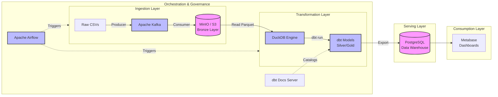

# Housing Data Pipeline: End-to-End Architecture & Concepts

This document provides a comprehensive overview of the Housing Data Pipeline. It is designed to help you understand how the system works end-to-end and give you the talking points needed to confidently explain it to stakeholders, recruiters, or other engineers.

---

## 1. High-Level Concepts & Architecture

The project is built on modern Data Engineering principles, primarily using a **Medallion Architecture** pattern (Bronze, Silver, Gold layers) and a **Modern Data Stack** (MDS) approach.

*   **Medallion Architecture:** A data design pattern used to logically organize data in a lakehouse, with the goal of incrementally and progressively improving the structure and quality of data as it flows through the pipeline.
*   **ELT (Extract, Load, Transform):** Instead of transforming data before loading it (ETL), we extract raw data, load it into a storage layer, and *then* transform it using the power of analytical engines (dbt + DuckDB).
*   **Data Governance:** Ensuring data quality, integrity, and discoverability through automated testing and documentation.

### Architecture Diagram

---

## 2. The Tech Stack Explained

Here is a breakdown of the specific tools used and *why* they were chosen:

| Component | Technology | Why we use it |
| :--- | :--- | :--- |
| **Message Broker** | **Apache Kafka** | Handles streaming data ingestion. It acts as a highly resilient buffer between the data source and our storage, ensuring we don't lose data if a downstream system goes offline. |
| **Data Lake Storage** | **MinIO** | An S3-compatible object storage. It acts as our "Bronze Layer" (Data Lake), storing raw data cheaply in optimized `.parquet` format. |
| **Transformation Engine** | **DuckDB** | An ultra-fast, in-memory analytical database. It queries the Parquet files directly from MinIO without needing to load them into a traditional database first. |
| **Transformation Logic** | **dbt (Data Build Tool)** | Handles the "T" in ELT. It allows us to write modular SQL `SELECT` statements to clean and aggregate data, treating SQL like software engineering (with version control, testing, and docs). |
| **Data Warehouse** | **PostgreSQL** | Acts as our serving layer. Once DuckDB/dbt finishes calculating the final "Gold" metrics, it pushes those small, clean tables into Postgres for fast querying by BI tools. |
| **Orchestration** | **Apache Airflow** | The "conductor" of the orchestra. It schedules and triggers the Python scripts and dbt commands in the correct sequence, handling retries and dependency management. |
| **Visualization / BI** | **Metabase** | Connects to Postgres to create interactive dashboards and charts for business users to consume the data easily. |
| **Infrastructure** | **Docker Compose** | Containerizes all of the above services so the entire environment can be spun up on any machine with a single command. |

---

## 3. Step-by-Step Data Flow

If you are explaining the project, walk through the data's journey step-by-step:

### Step 1: Data Extraction (The Producer)
A Python script (`producer.py`) simulates a real-time data feed. It reads raw housing listings and FRED economic indicators (like mortgage rates) from local files/APIs and publishes them as individual events to **Kafka** topics. 

### Step 2: Data Loading to Bronze (The Consumer)
A second Python script (`consumer.py`) listens to Kafka. It batches these incoming messages and writes them to **MinIO** as compressed **Parquet** files. Parquet is a columnar storage format that is highly optimized for analytical queries. This forms our raw "Bronze Layer."

### Step 3: Transformation to Silver & Gold (dbt + DuckDB)
**Airflow** triggers `dbt run`. 
*   **DuckDB** connects to MinIO via the `httpfs` extension and reads the raw Parquet files.
*   **dbt** creates **Staging Models** (Silver layer), which rename columns and cast data types (e.g., `stg_listings`).
*   **dbt** then creates **Data Marts** (Gold layer). These are highly aggregated business tables (e.g., `gold_affordability`, `gold_market_overview`) that calculate average prices, merge in mortgage rates, and segment properties.

### Step 4: Export to Serving Layer (Postgres)
Because DuckDB is an in-memory process that spins up just to do the math, we need a permanent place for dashboards to read from. Using a dbt `post_hook` and DuckDB's `postgres` extension, the final Gold tables are pushed directly into the **PostgreSQL Data Warehouse**.

### Step 5: Data Quality & Governance (dbt test & docs)
Airflow triggers `dbt test`. This runs automated checks against the newly created data in Postgres to ensure primary keys are `unique` and `not_null`. Finally, Airflow triggers `dbt docs generate`, which creates a fully searchable Data Catalog and lineage graph, served continuously via a dedicated web server on port 8081.

### Step 6: Consumption (Metabase)
Business users open **Metabase** (port 3000). Metabase queries the clean Gold tables in Postgres to populate the US Housing Market Dashboard, displaying KPIs, affordability maps, and market trends.

---

## 4. Key Talking Points (For Interviews / Presentations)

If asked about the strengths of this architecture, highlight these concepts:

*   **Separation of Compute and Storage:** By using MinIO for storage and DuckDB for transformation, we decouple the two. We can scale storage infinitely without paying for expensive database compute.
*   **Idempotency:** The pipeline is designed so that if it fails and runs again, it won't duplicate data. dbt drops and recreates the gold tables (`DROP TABLE IF EXISTS`), ensuring a clean state.
*   **Data Governance:** We treat data as a product. The pipeline isn't considered "successful" just because data moved; it must pass automated quality tests (`dbt test`) and update the data catalog (`dbt docs`).
*   **Hybrid Engine Approach:** We leverage the right tool for the job. We use DuckDB for heavy, fast, in-memory processing on Parquet files, but we serve the final lightweight results out of Postgres because Postgres is universally supported by BI tools like Metabase.
